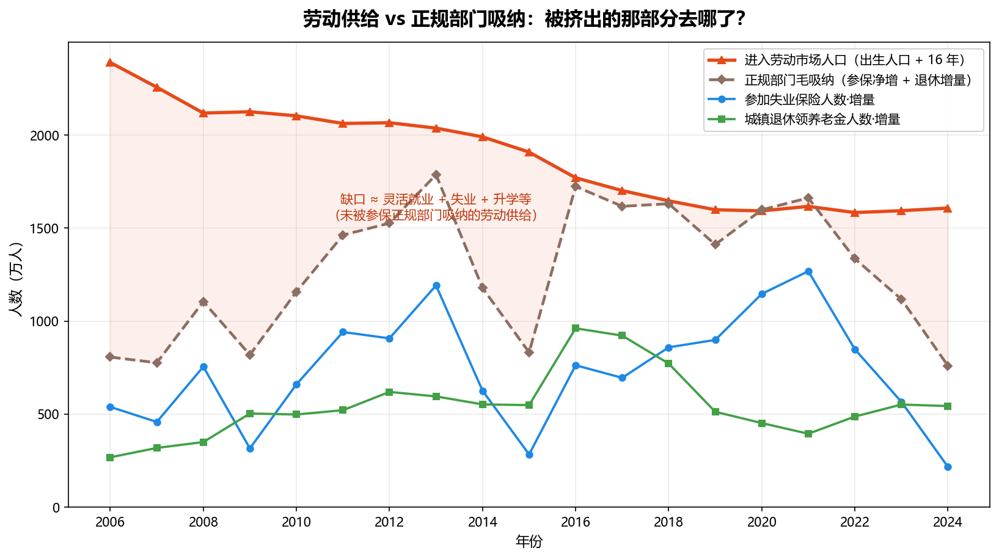

# 灵活就业比例挖掘

> 灵活就业到底占多少？从数据里把它挖出来。

灵活就业没有一个官方的直接统计口径——它是「非正规」的，天然躲在统计的缝隙里。既然正面数不到，那就换个思路：**从「劳动供给」和「正规部门吸纳」两头去夹，中间那块夹不住的差额，就是灵活就业（以及失业、升学等）的蓄水池。**

---

## 思路：用两个可获得的口径去「夹」

灵活就业本身查不到，但它两边的东西查得到：

- **一头是劳动供给**：每年有多少新人进入劳动市场？
- **另一头是正规部门的吸纳**：每年被「正规就业」接住的又有多少？

供给减去吸纳，剩下的没被正规部门接住的人，只能进入灵活就业、失业、或继续升学。这块差额，就是我想挖的东西。

## 三个代理指标

手上没有「灵活就业人数」，但有三组来自国家统计局 / 人社部的年度数据，可以拿来当代理（proxy）：

| 指标 | 代表什么 | 处理方式 |
| --- | --- | --- |
| **进入劳动市场人口** | 劳动供给的**流入** | 用「出生人口 + 16 年」近似——某一年出生的人，约 16 年后开始进入劳动市场 |
| **参加失业保险人数·增量** | 正规（参保）就业的**净增** | 失业保险覆盖的基本是城镇正规就业；它当年的净增量 ≈ 正规部门净增了多少人 |
| **城镇退休领养老金人数·增量** | 当年**退出**劳动力的人 | 每年新增多少人退休、离开劳动力市场 |

关键的一步是构造 **「正规部门毛吸纳」= 参保净增 + 退休增量**：

> 参保人数的净增，是「新进正规部门」减掉「退出正规部门（主要是退休）」之后的结果。想还原正规部门当年到底**新接住了多少人**，就要把退休掉的那部分加回去。所以毛吸纳 ≈ 参保净增 + 退休增量。

于是就得到一张对比图：**红线（劳动供给流入） vs 棕虚线（正规部门毛吸纳）**，两者之间的缺口，就是被正规部门「挤出」的那部分劳动供给。

## 图里读到的东西

- **缺口长期存在，而且很大。** 十几年里，进入劳动市场的人口（红线）一直明显高于正规部门的毛吸纳（棕虚线）。这条缺口，就是灵活就业 + 失业 + 升学等去处的总盘子——「隐形劳动力」从来不是小数目。
- **供给侧在系统性收缩。** 进入劳动市场的人口从 2006 年的约 2400 万，一路降到 2024 年的约 1600 万——这是二三十年前出生人口下滑的滞后回声，属于结构性、不可逆。
- **正规吸纳大起大落，近年塌陷。** 参保净增（蓝线）在 2021 年冲到 1268 万的高点后急转直下，2024 年只剩 216 万——正规部门几乎不再净增岗位。即便加回退休（绿线），2024 年的毛吸纳也从 2021 年的高位回落到约 760 万。
- **缺口的「质」在变化。** 早年缺口大，是因为供给洪峰太猛（每年两千多万新人）；近年供给已经缩了三分之一，缺口却没同步收窄——原因换成了正规部门这头吸纳乏力。同样一条缺口，前后的成因完全不同。

## 一句话结论

把「进得来的人」和「正规接得住的人」两条线摆在一起，中间那块持续几百万到上千万的缺口，就是灵活就业最可能藏身的地方。它先是被人口洪峰撑大，后来又被正规部门的吸纳塌陷续上——**灵活就业不是短期现象，而是长期供需错配的结构性沉淀。**

## 需要留一手的地方

这是一个**代理估算**，不是精确测量，几处近似必须说清楚：

- **失业保险 ≠ 全部正规就业**：还有一部分正规就业没被失业保险覆盖，参保增量会低估正规吸纳。
- **退出 ≠ 只有退休**：离开正规部门的还包括死亡、转灵活就业等，把「退出」全约等于「退休」是简化。
- **「出生 + 16」是粗近似**：真正进入劳动市场的年龄因升学而普遍延后（很多人 18～22 岁才进），且没扣死亡、没算迁移；这条线更适合看**趋势和量级**，而非某一年的绝对值。
- **所以缺口是「上限性」的**：它把失业、升学、参军、以及口径外的正规就业都算进了同一个池子，真正的「灵活就业」只是其中一块。这套方法的价值在于**看方向、看量级、看拐点**，不在于给出一个精确的百分比。

*数据来源：国家统计局、人力资源和社会保障部历年统计公报（2006–2024）。*
