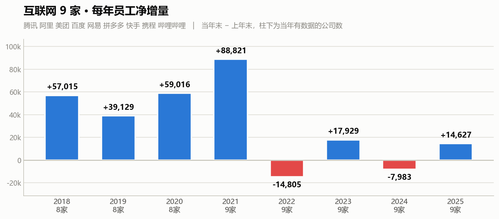
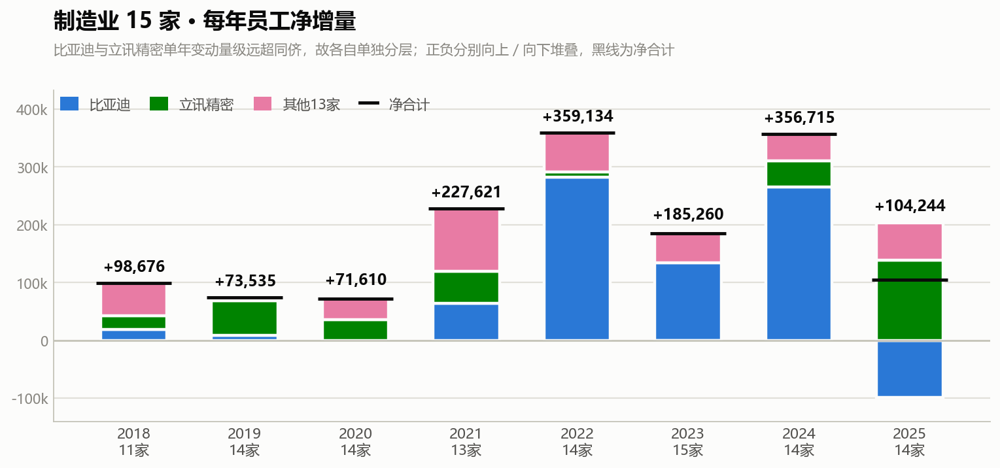

# 主流企业招聘规模变化

> 主流企业还在招人吗？看它们一年到底净增了多少人。

用工是经济最诚实的先行指标之一——嘴上说扩张还是收缩不算数，看年报里的员工人数变化。这里把 24 家主流上市公司 2017–2025 年的员工人数拉成时间序列，用**每年净增量**（当年末 − 上年末）近似当年的净招聘规模。

数据全部取自各公司年报原文：A 股〈公司员工情况〉、港股〈僱員〉、美股 20-F「Employees」、以及上市前的招股书。

---

## 互联网：2022 年一起踩了刹车

**2021 年是顶点，2022 年直接转负。** 从 +88,821 到 −14,805，而且不是个别公司拖累——腾讯、美团、百度、网易、快手、携程、哔哩哔哩**七家同时负增长**，9 家里只有阿里和拼多多逆势扩张。这是九年里唯一一次如此普遍的齐跌。

**此后是分化，不是复苏。** 合计数在 2023 年回正、2024 年再度转负、2025 年回到 +14,627，看似震荡走平，但驱动力完全不同：

- **持续扩张**：拼多多九年从 1,159 人到 25,474 人、**没有任何一年负增长**；腾讯 2024 年起恢复正增长
- **剧烈波动**：美团 2022 年 −8,101 → 2023 年 +22,799
- **持续收缩**：百度四年缩 26%（45,500 → 33,500）、网易缩 21%、快手缩 14%，三家至今未止跌

**头部规模已经趋同。** 2025 年腾讯 115,849、阿里 124,320、美团 111,298，三家挤在同一量级——前提是把阿里的高鑫零售剔除掉（见下文口径）。

## 制造业：同一年在反向扩张

**互联网 2022 年净减 1.5 万的同一年，制造业净增 35.9 万。** 两个板块的用工方向在这一年完全相反。

但这个总量几乎被两家公司主导，所以图里把它们各自单独分层：

- **比亚迪**：2022 年 +281,874、2024 年 +265,368，两次暴涨分别占当年合计的 **78%** 和 **74%**；2025 年又减 99,250
- **立讯精密**：2019 年 +58,932、2025 年 +138,094（一年涨 50%）
- **其他 13 家**（华为、美的、宁德时代、海尔、格力、中兴、海康威视、小米、蔚来、理想、TCL 科技、科大讯飞、影石创新）合计**八年从未为负**，但波动不小：最低 2019 年 +5,601，最高 2021 年 +107,973，多数年份在 4 万 ~ 7 万之间

**2025 年最能说明问题**：比亚迪 −99,250、立讯 +138,094，两家几乎正好对冲。只看净合计 +104,244，会完全错过这个此消彼长。

## 一句话结论

**互联网在 2022 年集体转入控编，至今只有拼多多和腾讯真正恢复扩张；制造业的用工总量则由比亚迪、立讯两家的并购与产能周期主导，剔除这两家后其余厂商的招聘一直平稳。** 所谓"主流企业还在不在招人"，答案高度取决于问的是哪个板块、哪几家公司。

## 需要留一手的地方

- **净增 ≠ 招聘。** 年度净增 = 招聘 − 离职 − 退休，还要叠加并购并表。负值不代表没招人，而是招得不如走得多。
- **几处大跳变是会计处理，不是招聘行为。** 阿里 FY2021 +13.4 万来自高鑫零售并表、FY2025 −8 万来自其出售（本页数据**已剔除**高鑫零售，但银泰尚未剔除）；立讯 2025 年 +138,094 的量级更像并表，用它解读招聘景气前需先核实当年收购事项。
- **合计会被"入表家数"污染。** 美团 2018 年、快手 2021 年才进入统计，制造业更参差，图中柱下已标注当年家数。
- **口径差异决定可比性。** 美团骑手、快手劳务外包均不计入员工数，故与同业可比；**京东因员工总数含大量快递员、无法与其他互联网公司横比，未纳入**。华为不单独披露员工总数，由「研发人数 ÷ 研发占比」反推，精度有限。
- **样本不是全行业普查。** 目前互联网 9 家、制造业 15 家，歌尔股份、中芯国际尚未采集，TCL 科技 2021 年报为扫描件暂缺。看方向，不看总量。

*数据来源：各公司 2017–2025 年度报告及招股书。完整数据底稿、逐年原文引用与核验记录另行归档。*
